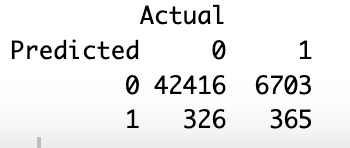

# Predicting Diabetes Risk – Logistic Regression in R  
**Author**: Houcine El  
**Project Type**: Statistical Modeling & Health Analytics  
## Video Presentation

  
   
  

---

## Project Overview  
In this project, I used logistic regression in R to analyze health and lifestyle data from the BRFSS 2015 dataset. My goal was to identify key predictors of diabetes, compare two predictive models using different feature sets, and evaluate their performance. The process included data wrangling, exploratory data analysis, feature selection, model training, and evaluation.

---

## Code

You can view the full R code here:  
**[R_Diabetes.Rmd](R_Diabetes.Rmd)**  

---

## Key Insights

### 1. BMI Distribution by Diabetes Status  
I visualized BMI distribution across three diabetes classes: no diabetes (0), prediabetes (1), and diabetes (2). There’s a clear shift toward higher BMI in diabetic individuals.

---

### 2. Class Balance  
After excluding prediabetic cases, I created a binary target (0 = No Diabetes, 1 = Diabetes). The dataset is imbalanced, with about **14.2% of individuals diagnosed with diabetes**.

---

### 3. Feature Significance – Full Model  
I ran a full logistic regression to identify statistically significant predictors. Features like **BMI, Age, HighBP, GenHlth ** had strong positive associations with diabetes. I used the resulting p-values to select features for two focused models.

---

### 4. Model Evaluation – Logistic Regression

#### Model 1: 
This model used "BMI", "HighChol", "HighBP", "Age" 
**Accuracy: 85.93%**

#### Model 2:
This model used "BMI", "HighChol", "HighBP", "HvyAlcoholConsump"
**Accuracy: 85.89%**

---

## Tools & Techniques Used  
- **Language**: R  
- **Libraries**: `tidyverse`, `ggplot2`  
- **Statistical Method**: Logistic Regression  
- **Core Techniques**: Data wrangling, visualization, feature selection, binary classification  
- **Model Evaluation**: Accuracy, Confusion Matrix  
